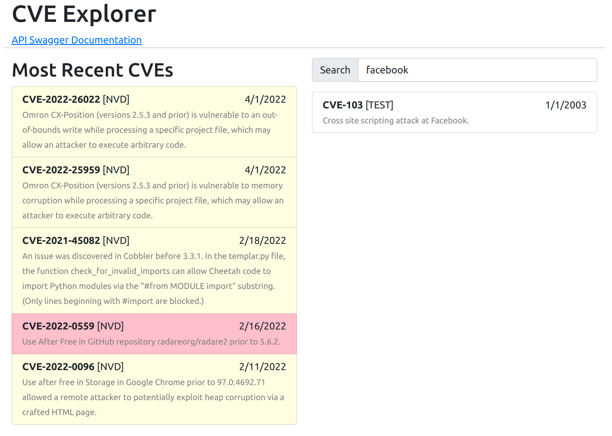

# CVE Explorer

| Branch | Status                            |
|---|-----------------------------------|
| master |  |

## About

CVE Explorer is a service that aggregates and displays information about Common Vulnerability and Exposures (CVE). It
exposes a CRUD api for local CVE management (see Swagger documentation). Additionally, it has a modularized approach for
consuming CVE's from external sources.

The UI displays the top 5 most recent CVE's are displayed, as well as implementing a search widget for searching CVE
descriptions. External feeds are refreshed every 30 minutes.

# Build

Clone repository:

    git clone https://github.com/Microsoft/vcpkg.git  
    cd cve-explorer  
    ./mvnw clean package

# Run

Run the server:

    ./mvnw spring-boot:run

In a separate terminal, open the html page with your favorite browser:

    firefox http://localhost:8080

View swagger documention for local CVE management:

    firefox http://localhost:8080/swagger-ui.html

# Develop

To develop a new feed

1. Create a new class "MyNewFeed" in com/example/cveexplorer/feed/
2. Implement the Feed interface
3. Enable the feed in <code>application.properties</code>: <code>feeds=MyNewFeed</code>

# Roadmap

1. Migrate to a more scalable database, eg MySQL
2. Handle error conditions more informatively, eg invalid POST data, invalid CVE format, etc.
3. API authentiation, eg only authorized users can create CVEs
4. Support more pageable and sortable options, eg more search options
5. Support more configurability, eg how often to run feed refreshes
6. Support more external feeds

# License

